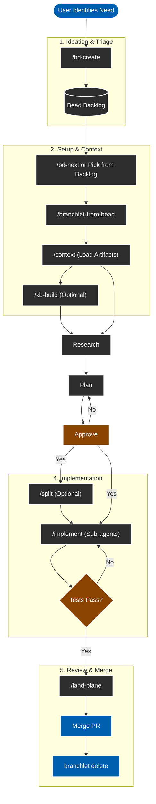

# Agentic Workflow Protocol

This protocol defines the mandatory workflow for AI agents (Amp) working in this repository. It integrates **Beads** (Issue Tracking), **Branchlet** (Worktrees), and **Slash Commands** (HumanLayer Protocol).

## 1. Ideation & Triage
- **User**: Run `/bd-create` (or identify a need).
- **Agent**: 
  - Interviews user to understand scope.
  - Generates title/priority/type.
  - Identifies lineage (blocks/discovered-from).
- **Outcome**: A Bead ID (e.g., `bd-a1b2`) exists in the backlog.

## 2. Setup & Context
- **User**: Run `/bd-next` to pick a task.
- **Agent**: Proposes top candidates. User selects `bd-a1b2`.
- **User**: Run `/branchlet-from-bead bd-a1b2` (Recommended) or switch branch.
- **User**: Run `/context bd-a1b2`.
  - **Agent**: Loads existing artifacts and summarizes state.
- **User (Optional)**: Run `/kb-build`.
  - **Agent**: Scans codebase to build/update shared architecture docs in `.beads/kb/`.

## 3. Research & Spec (Start New Thread)
- **User**: Run `/spec bd-a1b2` (Optional but recommended).
  - **Agent**: Refines Bead into a formal `spec.md`.
- **User**: Run `/research bd-a1b2`.
  - **Agent**: Scans codebase (and KB), creates `.beads/artifacts/bd-a1b2/research.md`.

## 4. Planning (Start New Thread)
- **User**: Run `/plan bd-a1b2`.
  - **Agent (Oracle)**: reasoning -> `.beads/artifacts/bd-a1b2/plan.md`.
- **Gate**: **HUMAN APPROVAL REQUIRED** on the plan.
- **User (Optional)**: Run `/split bd-a1b2` if plan is too large.

## 5. Implementation (Start New Thread)
- **User**: Run `/implement bd-a1b2`.
  - **Agent (Manager)**: Spawns **Subagents** for each plan step.
  - **Agent**: Updates status to `in_progress`.
  - **Agent**: Verifies builds/tests.

## 6. Review & Merge (Start New Thread)
- **Trigger**: Implementation complete, tests pass.
- **User**: Run `/land-plane`.
  - **Agent**: Runs final linters/tests.
  - **Agent**: `bd sync` to save issue state.
  - **Agent**: Pushes branch.
- **User**: Merge Pull Request.
- **User**: `branchlet delete` (cleanup).

## 7. Parallelism & Swarms (Epic Structure)
To complete Epics faster, structure Beads for **maximum parallel agent execution**:

1.  **The "Epic" Bead (The Manager)**
    - **Role**: Holds the master `research.md` and `plan.md`.
    - **Action**: Runs `/plan` and `/split`.
    - **Never**: Writes code directly.

2.  **The "Task" Beads (The Workers)**
    - **Role**: Single, independent unit of work (e.g., "Create UI Component", "Add DB Migration").
    - **Independence**: Must be solvable *without* waiting for other Tasks (unless explicitly blocked).
    - **Context**: Description MUST link to `.beads/artifacts/<EPIC_ID>/plan.md`.

3.  **Dependency Graphing**
    - **Sequential**: If Task B needs Task A's code, `bd create "Task B" --deps blocks:bd-A`.
    - **Parallel (Fan-out)**: If Task A and B are independent, they both just block the Epic.
    - **Agent Swarm**: You can launch multiple terminal tabs, creating a `branchlet` for each Task, and run `/implement` in parallel.

## 8. Context Hygiene
To ensure maximum reliability and avoid context window pollution:
- **Always start a new Amp thread** after running a slash command (e.g., after `/plan` finishes, start a new thread for `/implement`).
- This ensures the agent focuses only on the current step's artifacts (`plan.md`, `research.md`) without being distracted by the conversation history of previous steps.
- **Command Usage**: Slash commands populate the chat with a prompt template. **Always paste the Bead ID** at the end of the prompt (e.g., `/research bd-a1b2`) before sending.

## Summary of Tools
| Tool | Purpose |
| :--- | :--- |
| `bd` | Source of Truth (Status, Title, What) |
| `.md Artifacts` | Context (Research, Plan, How) - *Stored in .beads/artifacts/* |
| `branchlet` | Isolation (Filesystem, Git state) |
| `slash commands` | Protocol Enforcement (The "Verbs") |
