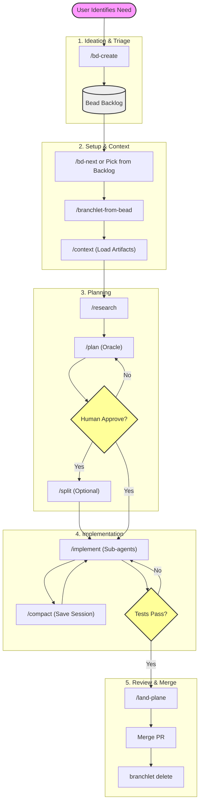

# Agentic Workflow Protocol

This protocol defines the mandatory workflow for AI agents (Amp) working in this repository. It integrates **Beads** (Issue Tracking), **Branchlet** (Worktrees), and **Slash Commands** (HumanLayer Protocol).

## 1. Ideation & Triage (Human + Agent)
- **Start**: User identifies a need.
- **Agent Action**: Run `/bd-create`.
  - Interviews user to understand scope.
  - Generates title/priority/type.
  - Identifies lineage (blocks/discovered-from).
- **Output**: A Bead ID (e.g., `bd-a1b2`) exists in the backlog.

## 2. Setup & Context (Agent)
- **Trigger**: User asks agent to start work on `bd-a1b2`.
- **Agent Action**: Ask user: "Use a dedicated worktree (Branchlet) or standard feature branch?"
  - **Worktree**: Run `/branchlet-from-bead bd-a1b2`. (Recommended for deep work).
  - **Feature Branch**: Run `git switch -c feature/bd-a1b2-...`. (Simpler).
- **Context Loading**: Run `/context bd-a1b2` to load artifacts if resuming.
- **Agent Action**: Run `/spec bd-a1b2` (Optional but recommended).
  - Refines Bead into a formal `spec.md`.
- **Agent Action**: Run `/research bd-a1b2`.
  - Scans codebase, creates `.beads/artifacts/bd-a1b2/research.md`.
  - Links research to Bead description.

## 3. Planning (Agent + Oracle)
- **Trigger**: Research complete.
- **Agent Action**: Run `/plan bd-a1b2`.
  - Reads `research.md`.
  - **Delegates to Oracle** for complex reasoning.
  - Creates `.beads/artifacts/bd-a1b2/plan.md`.
  - Breaks work into steps.
- **Gate**: **HUMAN APPROVAL REQUIRED** on `plan.md`.
- **Split**: If plan is too big, run `/split bd-a1b2` to create child beads.

## 4. Implementation (Manager + Subagents)
- **Trigger**: Plan approved.
- **Agent Action**: Run `/implement bd-a1b2`.
  - Acts as **Manager**.
  - Spawns **Subagents (Task tool)** for each plan step (edit/test).
  - Updates Bead status to `in_progress`.
- **Compaction**: Every ~30 mins or milestone, run `/compact bd-a1b2`.
  - Summarizes session to `.beads/artifacts/bd-a1b2/sessions/`.
  - Updates Bead `Session History`.
  - Keeps context window clean.

## 5. Review & Merge (Agent + Human)
- **Trigger**: Implementation complete, tests pass (`pnpm run check`).
- **Agent Action**: Run `/land-plane`.
  - Final `/compact`.
  - Runs linters/tests one last time.
  - `bd sync` to save issue state.
  - Pushes branch to remote.
- **Human Action**: Merge Pull Request (GitHub/GitLab).
- **Cleanup**: `branchlet delete` (removes worktree).

## 6. Parallelism & Swarms (Epic Structure)
To complete Epics faster, structure Beads for **maximum parallel agent execution**:

1.  **The "Epic" Bead (The Manager)**
    - **Role**: Holds the master `research.md` and `plan.md`.
    - **Action**: Runs `/plan` and `/split`.
    - **Never**: Writes code directly.

2.  **The "Task" Beads (The Workers)**
    - **Role**: Single, independent unit of work (e.g., "Create UI Component", "Add DB Migration").
    - **Independence**: Must be solvable *without* waiting for other Tasks (unless explicitly blocked).
    - **Context**: Description MUST link to `.beads/artifacts/<EPIC_ID>/plan.md`.

3.  **Dependency Graphing**
    - **Sequential**: If Task B needs Task A's code, `bd create "Task B" --deps blocks:bd-A`.
    - **Parallel (Fan-out)**: If Task A and B are independent, they both just block the Epic.
    - **Agent Swarm**: You can launch multiple terminal tabs, creating a `branchlet` for each Task, and run `/implement` in parallel.

## Summary of Tools
| Tool | Purpose |
| :--- | :--- |
| `bd` | Source of Truth (Status, Title, What) |
| `.md Artifacts` | Context (Research, Plan, How) - *Stored in .beads/artifacts/* |
| `branchlet` | Isolation (Filesystem, Git state) |
| `slash commands` | Protocol Enforcement (The "Verbs") |
