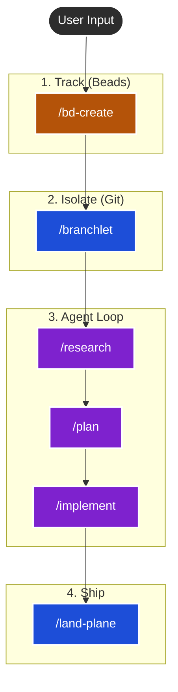

# Amp Maestro

A structured workflow for Sourcegraph Amp designed for complex tasks. It adds planning, context management, and sub-agent orchestration.

It utilizes **Beads** (Issue Tracking) and **Branchlet** (Worktrees) to manage agent context and isolation.

## Philosophy

This workflow implements the **"Frequent Intentional Compaction"** methodology championed by HumanLayer.



It enforces a structured process:

1.  **Research**: Understand the problem deeply before touching code.
2.  **Plan**: Create a detailed, architectural plan (with Oracle reasoning).
3.  **Manager/Worker**: The main agent acts as a manager, spawning sub-agents for implementation to keep context clean.
4.  **Compaction**: Regularly summarizing work into durable artifacts (`research.md`, `plan.md`, `sessions/`) to prevent context window pollution.
5.  **Artifacts over Memory**: Using the filesystem (`.beads/artifacts/`) as long-term memory, linked to Issues (`bd`).

## The Stack

*   **[Amp](https://ampcode.com)**: The AI Coding Agent (with Oracle & Sub-agents).
*   **[Beads (bd)](https://github.com/beads-dev/beads)**: Lightweight, CLI-first issue tracking that lives in git.
*   **[Branchlet](https://github.com/raghavpillai/branchlet)**: Git worktree manager for isolated agent environments.
*   **[HumanLayer](https://github.com/humanlayer/humanlayer)**: Creators of the "Context Engineering" and "12-Factor Agent" methodologies this workflow is based on.

## Installation

### Option 1: Local Install (Recommended)
Clone this repo and run the install script:

```bash
git clone https://github.com/lleewwiiss/amp-maestro.git
cd amp-maestro
./install.sh
```

### Option 2: Remote Install
If you have pushed this repo to GitHub, you can install it directly into any project:

```bash
/bin/bash -c "$(curl -fsSL https://raw.githubusercontent.com/lleewwiiss/amp-maestro/main/install.sh)"
```

## What it installs

1.  **Slash Commands** (`.agents/commands/`):
    *   `/bd-create`: Interview-first issue creation.
    *   `/bd-next`: Pick tasks and auto-spawn worktrees.
    *   `/research`: Deep context gathering (Librarian/MCP).
    *   `/plan`: Oracle-powered implementation planning.
    *   `/implement`: Manager/Worker implementation loop.
    *   `/review`: Plan vs. Implementation verification.
    *   `/land-plane`: Final pre-merge checklist.

2.  **Protocols**:
    *   `AGENTIC_WORKFLOW.md`: The master protocol document.
    *   Updates your `AGENTS.md` with the required "Source of Truth" rules.

## Usage

1.  **Start**: `amp`
2.  **Pick Work**: `/bd-next` (or `/bd-create` for new ideas).
3.  **Deep Work**: The agent will guide you through `/research` -> `/plan` -> `/implement`.
    *   **Important**: Start a new Amp thread after each command to ensure clean context.
    *   **Note**: Commands populate the chat with a prompt. **Paste the Bead ID** at the end of the command before sending.

## Requirements

*   `git`
*   `npm` / `pnpm` (for branchlet)
*   `amp` CLI installed
*   [Context7 MCP](https://github.com/upstash/context7) (Recommended for `/research` and library docs)
